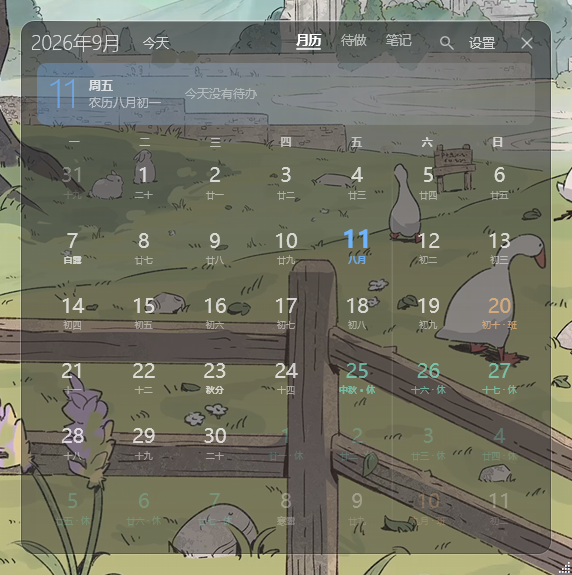
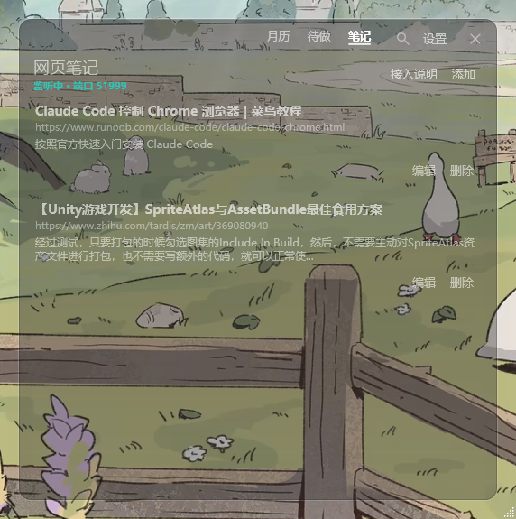

# 透明日历

盖在 Wallpaper Engine 壁纸上的桌面日历。待办、日记、网页划线都在上面，壁纸还是你原来那张。

A transparent calendar overlay for Windows, meant to sit on top of Wallpaper Engine.



打开电脑，它可以一直挂着。关掉进托盘，图标是当天日期，不进 Alt+Tab，也不占任务栏。想常驻又不挡别的窗口，设置里把窗口层级调成置底。

点格子写当天的待办和日记。待办能推迟到第二天，点取消会整批撤掉。网页上划一段字，右键就能存进来，按页面归组。



月历带农历和节气。法定放假、调休标在数字颜色上，周末用竖线跟工作日分开。今天除了颜色和字号，顶上还有一行摘要。

背景能拉到全透明，也可以开亚克力模糊。字色有清晰白、柔和青、暖金、高对比。想再沉一层，可以嵌进桌面、落到图标底下。Wallpaper Engine 开着时可能被壁纸盖住，托盘里有「恢复为普通窗口」。

## 跑起来

Windows 10 / 11，需要 .NET 9 SDK。

```powershell
dotnet run --project .\透明日历.csproj
```

也可以双击 `run.ps1`。PowerShell 被策略拦住时，双击 `启动透明日历.bat`。再开一次只会把已在跑的窗口唤到前台。

打成自带运行时的单个 exe：

```powershell
dotnet publish .\透明日历.csproj -c Release -r win-x64 --self-contained -p:PublishSingleFile=true
```

产物在 `bin\Release\net9.0-windows\win-x64\publish\TransparentCalendar.exe`。

### 网页划线

1. 打开 `chrome://extensions`
2. 打开「开发者模式」
3. 「加载已解压的扩展程序」，选仓库里的 `BrowserExtension`

选中文字后右键「划线保存到透明日历」，或按 `Ctrl+Shift+S`。工具栏图标打开的是状态面板，不是保存入口。

不装扩展的话，在应用的笔记页复制那段 `javascript:` 代码做成书签。接口只听本机，默认端口 `51999`。书签是从当前页面发请求的，恶意页面理论上能往笔记里写。

## 快捷键

| 按键 | 作用 |
|---|---|
| `←` / `→` | 上一月 / 下一月 |
| `T` 或 `Home` | 回到今天 |
| `Ctrl+F` | 展开搜索 |
| `Esc` | 收起搜索；没有搜索时藏到托盘 |

## 数据

都在 `%AppData%\透明日历\`。待办、日记、笔记、设置都在这，每天自动备份，保留最近 20 份。设置窗口可以导出 / 导入，也可以直接打开这个文件夹。

法定假日第一次要联网拉公开安排，缓存之后离线也能看。关掉「显示法定节假日与调休」就不会发请求。

## 改代码

约定写在 `AGENTS.md`。
